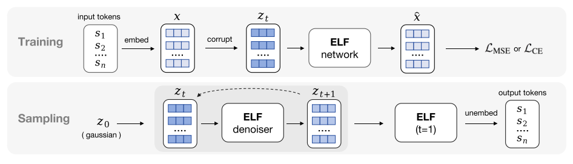
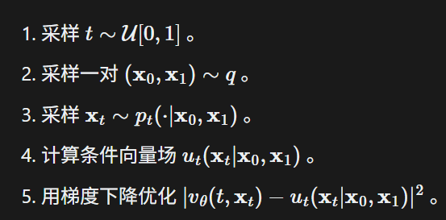
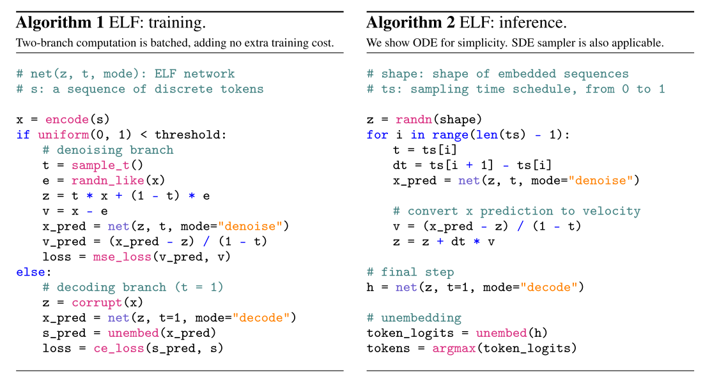
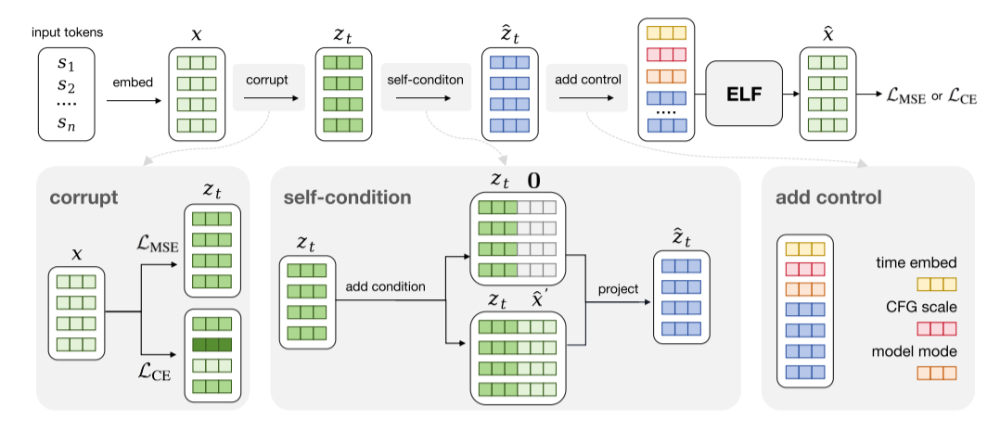
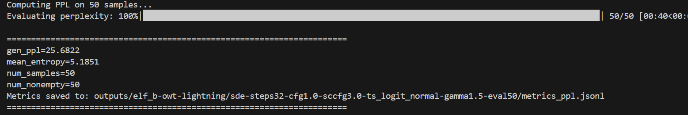
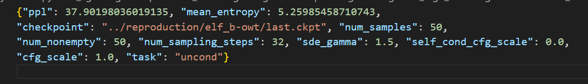
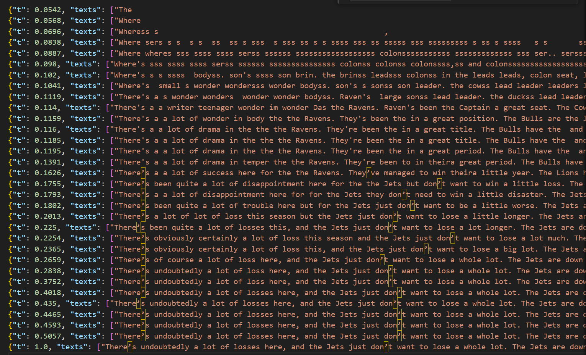
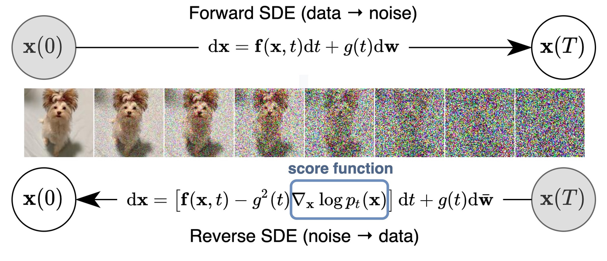

# ELF论文阅读

模型架构：将词序列映射到高维连续空间，在连续空间进行加噪/去噪（denoise网络），最后一步时通过decode网络得到token的logits



### Flow Match

流匹配直接学习条件向量场v，因此不需要显示计算$\log{p}$，去掉了显示加噪过程；我们希望拟合原分布（高斯噪声分布）和目标分布（干净图像分布）的边缘向量场，直接匹配条件向量场可以正确地学习到边缘向量场，而对于线性插值条件向量场是容易计算的，计算过程如下：



设 **$x$** 为干净文本序列的连续嵌入，**$\epsilon \sim \mathcal{N}(0, I)$** 为高斯噪声分布的样本。ELF 将时间 **$t \in [0, 1]$** 处的中间噪声状态 **$z_t$** 定义为线性插值：

$$
z_t = tx + (1-t)\epsilon
$$

模型的目标是学习一个速度场 **$v$**，它描述样本如何沿着这条轨迹移动。线性插值下的向量场为：

$$
v = \frac{dz_t}{dt} = x - \epsilon
$$

通过学习这个速度，模型可以从纯噪声 **$z_0$** 开始，并数值积分该流以达到干净的表示 **$z_1 \approx x$**。

该论文**创新**的地方在于：神经网络 **$x_{\theta}$** 不是直接预测速度 **$v$**，而是训练预测噪声输入 **$z_t$** 的干净数据点 **$x$**。然后通过代数推导预测的速度 **$v_{\theta}$**：

$$
v_{\theta}(z_t, t) = \frac{x_{\theta}(z_t, t) - z_t}{1 - t}
$$

这种方法在处理高维嵌入时提供了更高的稳定性。论文发现，虽然噪声预测在高维空间中可能会崩溃，**$x$**-预测仍然稳健，这使得 ELF 能够有效地利用大型嵌入空间。而且这种方法可以和最后的decode共用一个底层权重，使用两个不同的头（decoder和denoise）即可，节省训练的成本。

训练流程和推理流程:



对于decoder和denoiser头：有个细节，在准备decoder的输入数据实际上不是直接t=1（在  `train_step/train_step()` 中），decoder的 $\tilde{z}$ 被创建为 $\tilde{z} = px + (1-p)\epsilon_{\text{corrupt}}$，其中 $p \in [0, 1]$ 是从logit normal采样，这样可以让模型学习从不同噪声分布还原logit，而训练时模型会随机从两个头选择一个分支训练。

论文测试了decoder和denoiser共享权重和非共享权重的ppl和熵，发现共享权重的PPL更低，但是熵比较低；而非共享权重的熵会更高。

### CFG

由于是连续分布，因此直接用CFG引导分类，用外推场实现：

$$
v_{cfg}(z_t|c) = \omega v(z_t|c) + (1-\omega)v(z_t|\emptyset)
$$

参数 $\omega > 1$（引导尺度）控制多样性与质量之间的权衡。在 ELF 中，此过程通过训练时 CFG进一步优化，其中网络被训练以直接处理引导轨迹，从而降低了推理期间的计算成本。

具体实现（直接拼接，使用 `cond_seq_mask` 进行区分）：

```
[cond_token_0, cond_token_1, ..., inp_token_0, inp_token_1, ..., pad, pad]
|<-------- is_cond=True -------->|<--- is_cond=False ---->|<-- padding -->|
```

通过将条件向量掩码并在每次生成后强制覆盖为原始条件向量来控制类别，无条件即将条件向量置零

### self-conditioning

训练时两次前向，第一次得到的预测用于第二次的条件向量，即第一次为$\hat{x}'=net(z_t|x_{uncond},t)$，第二次为$\hat{x}=net(z_t|\hat{x}',t)$，他提供了额外的学习信号加速收敛，并且使用50%概率训练，即有可能是没有self-conditioning的一次前向

在推理时，模型以前一个时间步长的预测为条件，即输入是$z_t$和$\hat{x_{t-1}}$相拼接（在特征维度），并使用 `self_cond_cfg_scale`进行控制系数。



### SDE

该论文使用了ODE和SDE两种采样方法，位于 `utils/sampling_utils.py`，由于流匹配中是直接预测$v(x_t,t)$，因此ODE求解即为：$x_{t+\Delta t}=x_t+\Delta t*v$；而论文中使用SDE风格的采样，对$x_t$进行扰动计算$x_t'=\alpha x_t+(1-\alpha)\epsilon$，且对时间进行回退$t'=t*\alpha$（噪声更多了更接近$x_0$）。而最后一步一定是ode，因为需要干净的图片（之后再从连续转为离散）。

### 具体任务

翻译/总结任务：

他们都是生成任务，且有一定条件约束，在 `/generation/test_generation_cond`下，将条件向量通过T5编码器进行编码，然后将条件向量传给模型（CFG）。

将一个句子随机几处mask，用ELF还原，具体做法，修改条件变量的mask，让ELF在mask里面从噪声还原。

### 一些细节

训练时对t需要采样，原文代码使用 `logit_normal`，该采样为采样$N(\mu,\sigma)$，然后通过sigmoid函数归到$[0,1]$，原文设置了$\mu=-0.8$，即中心在0.30附近，采样会集中在中心，因为中间的任务会比两端任务更复杂。

（self_conditioning中，训练是自己前向两次，推理是使用上一次，他们对齐了吗？误差比较小）

### 测试

由于官方没有GPU版本的，使用[Ugness/ELF-pytorch](https://github.com/Ugness/ELF-pytorch)，进行测试

使用gpt2-large模型计算ppl和平均熵（ppl：$P(w_1,\ldots,w_n)^{-\frac{1}{N}}$，一个模型对他出现越肯定，说明文本生成越自然；平均熵：对每一个位置计算熵并取平均）

```
超参数（与原论文相同配置）：
sde
steps32
cfg1.0
sccfg3.0
ts_logit_normal
gamma1.5
eval50 # 生成50个样本并评价
```



可以看到与论文(24.1/5.15)相似

---

在sccfg0.0（即没有self-conditioning）的结果：

ppl增加了很多，说明文本生成不太自然，但是相应的熵也增加了，说明模型输出更丰富了



---

论文是每次预测$x$的，可以把每个时间步x打印出来并解码（由于decoder训练时适应了不同噪声还原文本，因此可以直接使用decoder解码），可以看到在后面几步生成的文章相似了，说明模型在32步内就收敛了，而且观察到t的时间步都是在0.5左右终止的



### 附录

#### SDE

##### 正向扩散

通过对DDPM的泰勒展开，有：

$$
\frac{x(t_k) - x(t_{k-1})}{\Delta t}
\approx
\frac{b(t_{k-1})}{2} x(t_{k-1})
+
\sqrt{b(t_{k-1})}\,\frac{z_{k-1}}{\sqrt{\Delta t}}
$$

而右式在$\Delta t \to 0$时，是白噪声

因此可以用布朗运动表示，由此将DDPM从离散转到了连续，DDPM的特点是方差保持（不会在多步后数值爆炸）

对该式进行数值求解时需要重新转换为离散形式：

$$
x_{t+\Delta{t}}=x_t+f(x_t,t)\Delta t+g(t)\sqrt{\Delta t}*z_t
$$

##### 反向去噪

需要通过分数函数和反向布朗运动得到（从高熵到低熵），扩散模型的本质是学习分数函数



而通过Fokker-Planck方程，找到一个ODE$dx_t=v(x,t)dt$的密度演化与SDE相同，推导得到$v(x_t,t)=f(x_t,t)-\frac{1}{2}g^2(t)\Delta_x\log{p_t(x)}$
