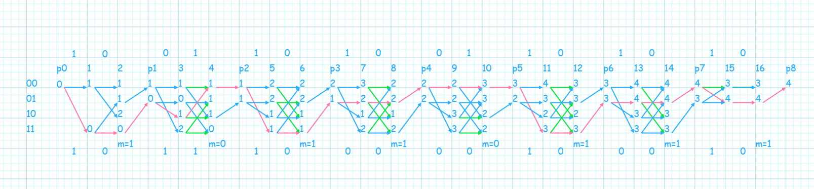

在信息隐写中可以通过STC编码来最小化失真函数，该方法用了动态规划的思想，可以找到最小修改位并能通过钥匙矩阵还原出隐写信息，本文用C++实现了一个简单的STC编码代码。

<!-- more -->

编码目标：$\min{D(x,y)}$，且$Hy=m(\text{mod}\ 2)$，其中m为隐藏信息

编码$x=1001101001101010，m = 10110111$，小矩阵为：

$$
\hat{H}=\begin{bmatrix}
1 & 0 \\
1 & 1
\end{bmatrix}
$$

x的长度为16，m的长度为8，小矩阵为2*2

### 参数配置

校验矩阵由小矩阵摆上一个矩阵的右侧，并下移一行组成，大小为$8*16$（由m的长度和x的长度决定），对于二元嵌入，格子图需要包含8个子块，代表对子矩阵$\hat{H}$的处理；每个子块需要由$2^2=4$行，$2+1=3$列，因此局部校验子编号为$\{00,01,10,11\}$

### 格子图

最左列表示状态，其中高位在左；每个节点的值表示修改位数；最上一行表示x，最下一行表示y；由箭头表示的线表示不同嵌入方法，绿线表示删除的路径，红线表示最优路径。



#### 过程说明

对于题目的小矩阵，状态为11和10（从下往上读，因为高位在左）

* p0到1：初始状态为00，可以选择是否修改x的第一位bit，状态根据小矩阵的第一列转移，如果修改，则状态改为00+11*0=00，且修改位数；不修改，则状态改为00+11\*1=11，且修改位数保持为0
* 1到2：根据小矩阵的第二列转移，有两个状态，分别考虑修改第2位和不修改第二位的状态
* 2到p1：此时到第二个子块，需要保证最低位为m的第一位，因此选择1和3状态，由于校验矩阵构造时小矩阵下移一位，因此状态右移一位变为1和2。
* 以此类推...，当p7转移时，校验矩阵的小矩阵变为以下矩阵，因此这时不会再出现2和3状态。

$$
\hat{H}=\begin{bmatrix}
1 & 0 \\
0 & 0
\end{bmatrix}
$$

* 到达p8时结束状态转移，可以根据该格子图反推得到y，与p8连接的是16的1状态，然后是15的1状态，两个状态的修改位数不变，说明该位没有变化，因此y的第16位与x的第16位相同，以此类推。

### 结果

> y为**1011,1000,0010,0010**，其中修改位为4位。

由图可以看到有多种答案（在第10列的3以及第15列的4可以通过多种方式到达），这里显示其中一种

### 附录

计算使用cpp实现算法，关键代码及解析如下：

```python
int h(int index,int k)//h，当最后一个子块时会有变化
{
	int tt[3]={3,2};
	if(k==len/2)return tt[index]&1;
	else return tt[index];
}
for(int k=1;k<=len/2;k++)
{
	printf("=====\n");//每个子块内部的计算
	for(int t=0;t<2;t++)
	{
		int now=(x>>(len-i-1))&1;
		for(auto llp : ll)
		{
			int cgn=llp xor h(t,k)*(1-now),ucgn=llp xor h(t,k)*now;
			//cgn表示改变当前比特的下一步状态，ucgn表示不改变的状态
			printf("%d: %d to %d %d\n",i+1,llp,cgn,f[i][llp]+1);
			printf("%d: %d to %d %d\n",i+1,llp,ucgn,f[i][llp]);
			if(f[i+1][cgn]>f[i][llp]+1){
				f[i+1][cgn]=f[i][llp]+1;
				g[i+1][cgn][0]=llp;g[i+1][cgn][1]=1-now;
			}
			if(f[i+1][ucgn]>f[i][llp]){
				f[i+1][ucgn]=f[i][llp];
				g[i+1][ucgn][0]=llp;g[i+1][ucgn][1]=now;
			}
			//g[][][0]用于追踪上一个状态，g[][][1]用于表示当前bit的y
			nl.insert(cgn);nl.insert(ucgn);
		}
		ll=nl;
		nl.clear();
		i++;
	}
	printf("p_%d:\n",k);
	int nowm=(m>>(len/2-k)) & 1;
	int temp[5]={100};
	for(auto llp:ll)//跳到下一个子块，状态需要右移，且要保证最低位为m的第k位
	{
		if(llp%2==nowm)//最低位，不会受后面bit影响
		{
			temp[llp>>1]=f[i][llp];nl.insert(llp>>1);
			printf("%d to %d %d\n",llp,llp>>1,f[i][llp]);
			p[k][llp>>1]=llp;
		}
	}
	ll=nl;nl.clear();
	for(int j=0;j<4;j++)f[i][j]=temp[j];
}

int nn=*ll.begin(),ans=0;//回溯到答案，ans即为所求y
i=len;
for(int k=len/2;k>=1;k--)
{
	nn=p[k][nn];
	for(int t=0;t<2;t++)
	{
		ans+=(g[i][nn][1]<<(len-i));
		nn=g[i][nn][0];
		i--;
	}
}

```
